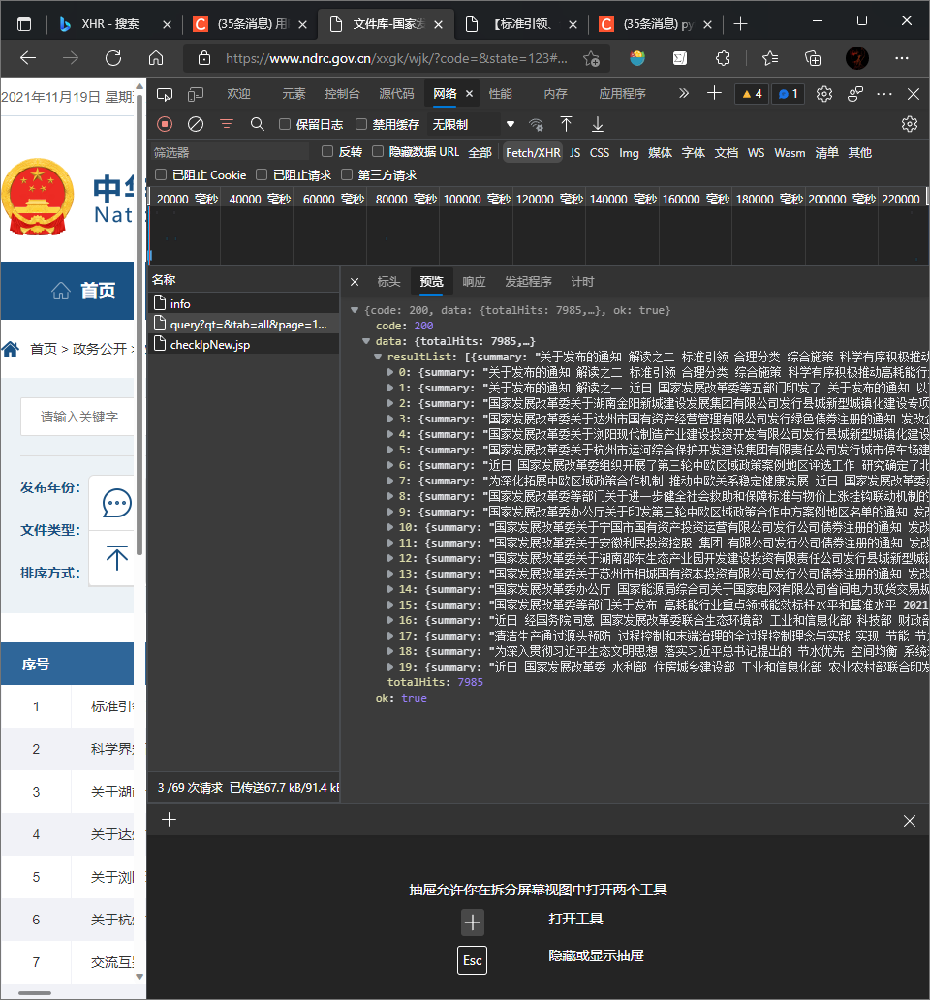

# 网络爬虫

爬虫过程发生了以下四个步骤：

- 查找域名对应的IP地址。
- 向IP对应的服务器发送请求。
- 服务器响应请求，发回网页内容。
- 浏览器解析网页内容。

**网络爬虫要做的，简单来说，就是实现浏览器的功能。通过指定url，直接返回给用户所需要的数据，而不需要一步步人工去操纵浏览器获取。**

***

## 相关知识

***URL***

我们在浏览器的地址栏里输入的网站地址叫做URL (Uniform Resource Locator，统一资源定位符)。就像每家每户都有一个门牌地址一样，每个网页也都有一个Internet地址。当你在浏览器的地址框中输入一个URL或是单击一个超级链接时，URL就确定了要浏览的地址。浏览器通过超文本传输协议(HTTP)，将Web服务器上站点的网页代码提取出来，并翻译成漂亮的网页。因此，在我们认识HTTP之前，有必要先弄清楚URL的组成,例如：http://www.baidu.com/china/index.htm。它的含义如下：

1. **http://**：代表超文本传输协议，通知baidu.com服务器显示Web页，通常不用输入；

2. **www**：代表一个Web（万维网）服务器；

3. **baidu.com/**：这是装有网页的服务器的域名，或站点服务器的名称；

4. **China/**：为该服务器上的子目录，就好像我们的文件夹；

5. **Index.htm**：index.htm是文件夹中的一个H搜索TML文件（网页）


URL一般格式

```
protocol :// hostname[:port] / path / [;parameters][?query]#fragment
```

1. protocol(协议)：
   指定使用的传输协议，下面也列出了几种protocol属性的有效方案名称。那我们最常用的就是HTTP协议，它也是目前www中应用最广泛的协议。
   file 资源是本地计算机上的文件。格式file:///，注意后边应是三个斜杠。
   ftp 通过 FTP访问资源。格式 FTP://
   gopher 通过 Gopher 协议访问该资源。
   http 通过 HTTP 访问该资源。 格式 HTTP://
   https 通过安全的 HTTPS 访问该资源。 格式 HTTPS://
   mailto 资源为电子邮件地址，通过 SMTP 访问。 格式 mailto:

2. hostname(主机名)

   是指存放资源的服务器的域名系统(DNS) 主机名或 IP 地址。有时，在主机名前也可以包含连接到服务器所需的用户名和密码（格式：username:password@hostname）。

3. port(端口号)

   整数，可选，省略时使用方案的默认端口，各种传输协议都有默认的端口号，如http的默认端口为80。如果输入时省略，则使用默认端口号。有时候出于安全或其他考虑，可以在服务器上对端口进行重定义，即采用非标准端口号，此时，URL中就不能省略端口号这一项。

4. path（路径）

   由零或多个“/”符号隔开的字符串，一般用来表示主机上的一个目录或文件地址。

5. parameters（参数）
   这是用于指定特殊参数的可选项。

6. query(查询)

   可选，用于给动态网页（如使用CGI、ISAPI、PHP/JSP/ASP/ASP。NET等技术制作的网页）传递参数，可有多个参数，用“&”符号隔开，每个参数的名和值用“=”符号隔开。

7. fragment（信息片断）

   字符串，用于指定网络资源中的片断。例如一个网页中有多个名词解释，可使用fragment直接定位到某一名词解释。

[(22条消息) URL格式_hhthwx的博客-CSDN博客_url](https://blog.csdn.net/hhthwx/article/details/78567961)


***get&post***

- **GET** - 从指定的资源请求数据。
- **POST** - 向指定的资源提交要被处理的数据。

[GET 和 POST 到底有什么区别？ - 知乎 (zhihu.com)](https://www.zhihu.com/question/28586791)

## Xpath

XPath 使用路径表达式来选取 XML 文档中的节点或者节点集。这些路径表达式和我们在常规的电脑文件系统中看到的表达式非常相似。

### 节点

七种类型节点：元素、属性、文本、命名空间、处理指令、注释以及文档根节点。XML文档是被作为节点树来对待的。

```html
<?xml version="1.0" encoding="ISO-8859-1"?>

<bookstore>

<book>
  <title lang="en">Harry Potter</title>
  <author>J K. Rowling</author> 
  <year>2005</year>
  <price>29.99</price>
</book>

</bookstore>
```

```html
<bookstore> （文档节点）
<author>J K. Rowling</author> （元素节点）
lang="en" （属性节点） 
```

### 节点

| 表达式   | 描述                                                       |
| :------- | :--------------------------------------------------------- |
| nodename | 选取此节点的所有子节点。                                   |
| /        | 从根节点选取。                                             |
| //       | 从匹配选择的当前节点选择文档中的节点，而不考虑它们的位置。 |
| .        | 选取当前节点。                                             |
| ..       | 选取当前节点的父节点。                                     |
| @        | 选取属性。                                                 |

| 路径表达式      | 结果                                                         |
| --------------- | ------------------------------------------------------------ |
| bookstore       | 选取bookstore元素的所有子节点。                              |
| /bookstore      | 选取根元素bookstore。                                        |
| bookstore/book  | 选取属于 bookstore 的子元素的所有 book 元素。                |
| //book          | 选取所有 book 子元素，而不管它们在文档中的位置。             |
| bookstore//book | 选择属于 bookstore 元素的后代的所有 book 元素，而不管它们位于 bookstore 之下的什么位置。 |
| //@lang         | 选取名为 lang 的所有属性。                                   |


***

# 政策爬虫（以国家发改委官网为例）

------


## 对异步输出网址爬虫的措施

由于国家发改委的网站是**异步输出**，直接对网址的元素爬取结果为空，即政策信息为保存在用户访问的网址中，

**异步传输**：通常数据传输有两种模式，同步传输和异步传输。同步传输是将一个数据块直接发送，这样呈现给我们的就是通常的静态网页，那么和为异步传输？异步传输是将数据分为一块一块的，不直接呈现一个完整的数据，

我们需要查看网址的XHR可以看到有3个XHR，依次检查，我们点击每一项，在右侧相应中查看自己想要的信息，我们可以在第2个XHR中发现自己想要的信息，如下图所示：



那么此时我们就发现了自己想要的信息，那么接下来我们点击消息头，在消息头中我们可以看到请求网址，那么这个网址就是包含政策信息的”真网址“。

把之前访问的网站替换成消息头的url即可获取到政策信息。

### 伪装头部信息和接入搜索接口

```python
url='https://fwfx.ndrc.gov.cn/api/query?qt=&tab=all&page='+str(i)+'&pageSize=20&siteCode=bm04000fgk&key=CAB549A94CF659904A7D6B0E8FC8A7E9&startDateStr=&endDateStr=&timeOption=0&sort=dateDesc'
headers={'User-Agent':'Mozilla/5.0(Windows;U;Windows NT6.1;en-US;rv:1.9.1.6) Geko/20091201 Firefox/3.5.6'}#浏览器代理
```

### 获取json格式的内容

```python
def get(url):
    # 禁用安全请求警告
    requests.packages.urllib3.disable_warnings()
    # 发出请求，使用post方法，这里使用前面自定义的头部和参数
    # verify=False，针对https协议,若不加该代码无法通过SSL验证
    r = requests.post(url, headers=headers,verify=False)
    # 使用json库中loads函数，将r.text字符串解析成dict字典格式存储于js中
    js = json.loads(r.text)
    # print(js)
```

### 分析网页结构


通过层层剥离，最终可以获取目标信息，代码如下：

```python
def getList(length):
    Titles=[]
    urls=[]
    for i in range(length):
        Title = js['data']['resultList'][i]['dreTitle']
        time = js['data']['resultList'][i]['docDate']
        organization = js['data']['resultList'][i]['domainSiteName']
        suburl = js['data']['resultList'][i]['url']
        print(Title+time+organization+suburl)
```

### 获取每个政策的标题、时间、机构、链接

```python
def getList(length):
    Titles=[]
    urls=[]
    for i in range(length):
        Title = js['data']['resultList'][i]['dreTitle']
        time = js['data']['resultList'][i]['docDate']
        organization = js['data']['resultList'][i]['domainSiteName']
        suburl = js['data']['resultList'][i]['url']
        print(Title+time+organization+suburl)

        Titles.append(Title)
        urls.append(suburl)

        return Titles,urls
```

### 爬取每个政策的子链接内容并保存成txt文档

```python
for i in range(len(urls)):
    try: 
        res = urllib.request.urlopen(urls[i])  
        html = res.read().decode('utf-8') 
        soup = BeautifulSoup(html, 'lxml')

        print(str(i)+'saved')
        for p in soup.select('p'):
            t = p.get_text()
            txt(Titles[i],t)
            except OSError:
                pass    
            continue

```

```python
picpath='./newws/'
def txt(name, text): 
    if not os.path.exists(picpath): 
        os.makedirs(picpath)
    savepath = picpath + name + '.txt'
    file = open(savepath, 'a', encoding='utf-8')#因为一个网页里有多个标签p，所以用'a'添加模式
    file.write(text)
    # print(text)
    file.close
```

### 检测附件

通过匹配附件文件的后缀名检测网页中是否存在附件

### 完整代码

```python
import urllib.request
import requests
import time
import json
import numpy as np
import pandas as pd
from bs4 import BeautifulSoup  # 导入urllib库的request模块
import lxml                    #文档解析器
import os                      #os模块就是对操作系统进行操作


def get(url):


    # 禁用安全请求警告
    requests.packages.urllib3.disable_warnings()

    # 发出请求，使用post方法，这里使用前面自定义的头部和参数
    # verify=False，国家统计局20年下半年改用https协议,若不加该代码无法通过SSL验证
    r = requests.post(url, headers=headers,verify=False)

    # 使用json库中loads函数，将r.text字符串解析成dict字典格式存储于js中
    js = json.loads(r.text)
    # print(js)

# 数据预处理，获取json列表中层层包裹的strdata元素（数据）
    def getList(length):
        Titles=[]
        urls=[]
        for i in range(length):
            Title = js['data']['resultList'][i]['dreTitle']
            time = js['data']['resultList'][i]['docDate']
            organization = js['data']['resultList'][i]['domainSiteName']
            suburl = js['data']['resultList'][i]['url']
            print(Title+time+organization+suburl)

            Titles.append(Title)
            urls.append(suburl)

        return Titles,urls


    length=len(js['data']['resultList'])
    Titles,urls=getList(length)


    for i in range(len(urls)):
        try: 
            res = urllib.request.urlopen(urls[i])  
            html = res.read().decode('utf-8') 
            soup = BeautifulSoup(html, 'lxml')

            print(str(i)+'saved')
            for p in soup.select('p'):
                t = p.get_text()
                txt(Titles[i],t)
        except OSError:
            pass    #如果报错就不管，继续读取下一个url
        continue
    
#定义txt存储路径。
picpath='./newws/'#这里我用的是本程序路径，也可改为c盘或d盘等路径。
def txt(name, text):  # 定义函数名
    if not os.path.exists(picpath):  # 路径不存在时创建一个
        os.makedirs(picpath)
    savepath = picpath + name + '.txt'
    file = open(savepath, 'a', encoding='utf-8')#因为一个网页里有多个标签p，所以用'a'添加模式
    file.write(text)
    # print(text)
    file.close
if __name__ == '__main__':
    for i in range(5):
        url='https://fwfx.ndrc.gov.cn/api/query?qt=&tab=all&page='+str(i)+'&pageSize=20&siteCode=bm04000fgk&key=CAB549A94CF659904A7D6B0E8FC8A7E9&startDateStr=&endDateStr=&timeOption=0&sort=dateDesc'
        headers={'User-Agent':'Mozilla/5.0(Windows;U;Windows NT6.1;en-US;rv:1.9.1.6) Geko/20091201 Firefox/3.5.6'}#浏览器代理
        get(url)


```

